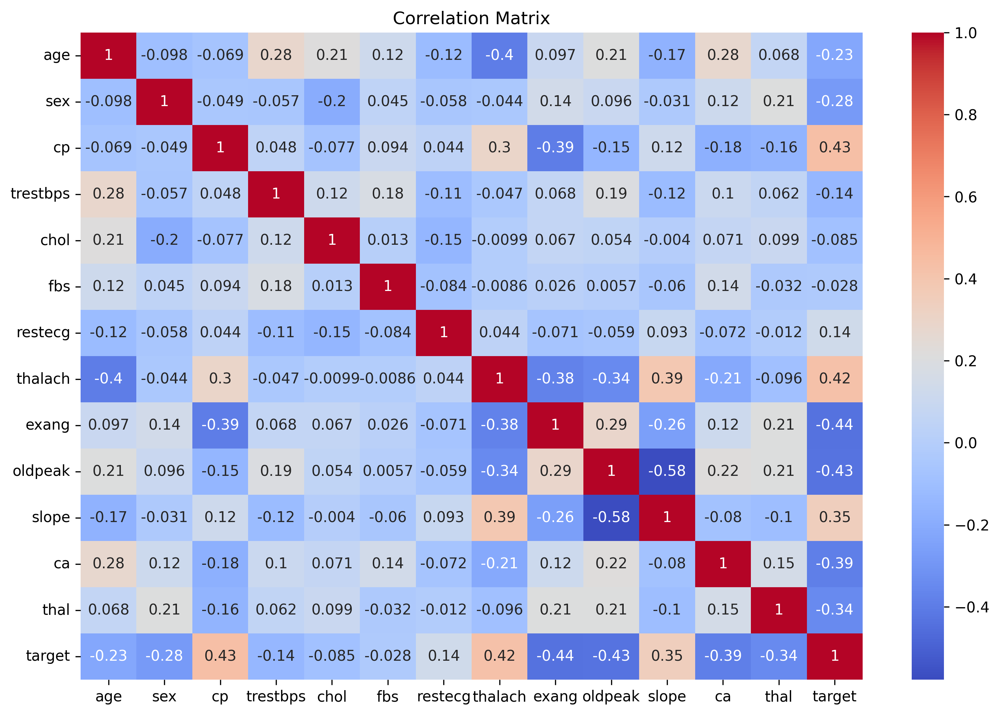
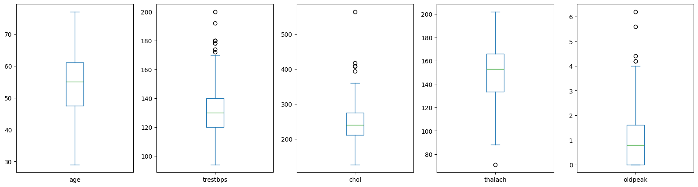
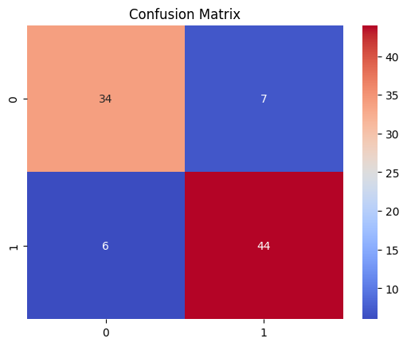
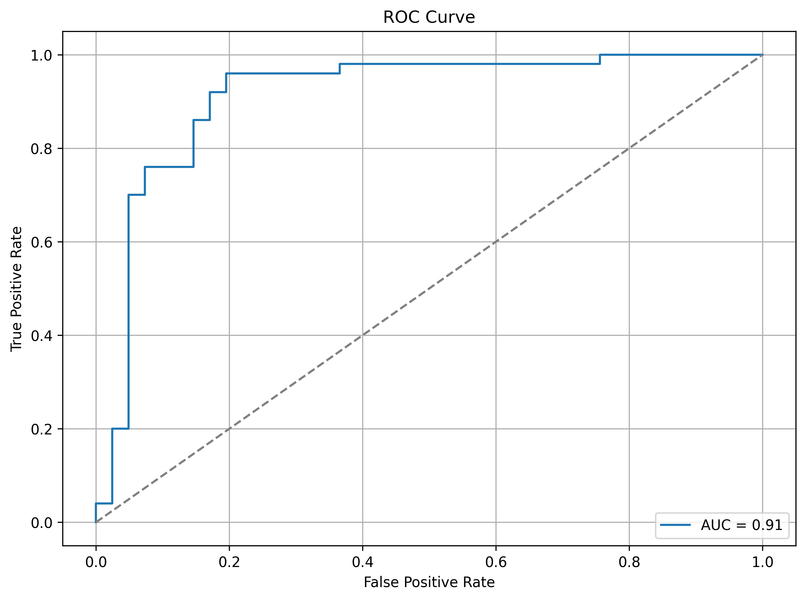
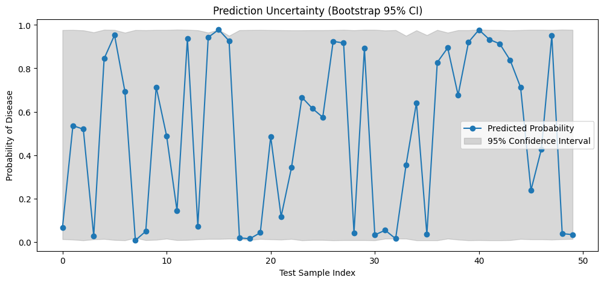
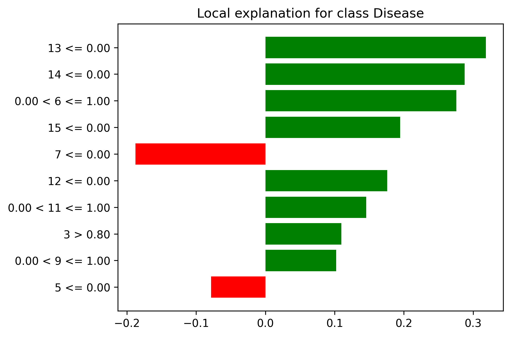

# 🫀 Heart Disease Prediction

This project applies machine learning to predict the presence of heart disease using clinical data. It combines domain-relevant visualizations, uncertainty estimation, and explainability to create a transparent and clinically interpretable model.

---

##  Project Motivation

Heart disease remains one of the leading causes of death worldwide. Early detection and clinical decision support tools can significantly improve patient outcomes. This project demonstrates:

- The predictive power of clinical indicators
- How machine learning can support diagnostic decisions
- How to make black-box models more interpretable and trustworthy

---

📁 Project Structure

Notebooks/
└── heart_disease_analysis.ipynb       # Main analysis and model development

data/
└── heart.csv                          # UCI Cleveland dataset

visuals/                               # All saved visualizations
├── correlation_heatmap.png
├── target_distribution.png
├── boxplots_numerical.png
├── confusion_matrix.png
├── roc_curve.png
├── feature_importance_logreg.png
├── lime_explanation_instance5.png
└── uncertainty_bootstrap.png

heart_disease_analysis.py              # Script version of the notebook
README.md                              # Project documentation


---

##  Dataset

The project uses the **[Heart Disease UCI Dataset](https://www.kaggle.com/datasets/cherngs/heart-disease-cleveland-uci)** contributed by Cherngs on Kaggle. It is derived from the Cleveland Clinic dataset, widely used in cardiovascular research.

**Citation:**
> Cherngs. (2020). *Heart Disease UCI Dataset*. Retrieved from [Kaggle](https://www.kaggle.com/datasets/cherngs/heart-disease-cleveland-uci).

---

##  Requirements

- Python 3.7+
- pandas
- scikit-learn
- seaborn
- matplotlib
- lime

Install with:

```bash
pip install -r requirements.txt
 Exploratory Data Analysis
Key visualizations for understanding feature distributions and relationships:


```

 Correlation Heatmap



 Boxplots of Numeric Features



 ##  Model Training
A logistic regression model is trained using standard preprocessing pipelines (scaling, one-hot encoding).

✅ Evaluation Metrics
Accuracy: 86%

Precision: 84%

Recall: 89%

##  Model Evaluation

 Confusion Matrix


 ROC Curve


 Uncertainty Quantification




We use bootstrap resampling to estimate prediction confidence intervals.


This adds robustness and communicates the model's uncertainty — necessary in clinical settings.


##  Model Explainability with LIME
We apply LIME (Local Interpretable Model-Agnostic Explanations) to understand which features contribute most to a specific prediction.

This is essential for clinical trust and interoperability.




###  Clinical Insight Example:

High thalach (maximum heart rate) is typically associated with lower risk.

cp (chest pain type) may increase or decrease risk depending on context.


✅ How to Use

git clone https://github.com/SamInMotion/heart-disease-prediction.git
cd heart-disease-prediction

Run the notebook:

Notebooks/heart_disease_analysis.ipynb

Or run the .py script:

python heart_disease_analysis.py


##  Author
Samuel Okoe-Mensah
LinkedIn | GitHub
Machine Learning Practitioner with a focus on Explainable AI and Healthcare

##  License
This project is licensed under the MIT License.
